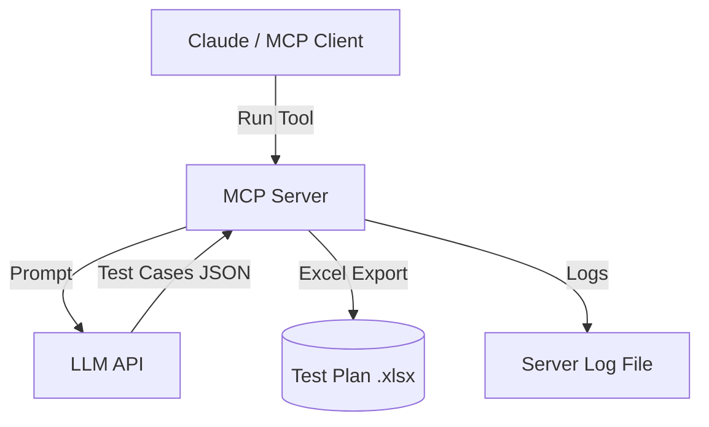

# 🤖 AI Testcase Generator MCP

An **Model Context Protocol(MCP) server** that generates comprehensive **API test plans** (positive, negative, and boundary/edge cases) directly from endpoint metadata—powered by **LLMs**.

This is a TypeScript-based Model Context Protocol(MCP) server for QA engineers. It demonstrates core Model Context Protocol concepts by providing:

- AI-powered tool for generating exhaustive test case plans from API endpoints and payloads
- Prompt-driven LLM integration for quality and coverage
- Extensible structure for future automation tooling

## ✨ Features

- 🔌 **MCP-compliant server** (`stdio` transport).  
- 📝 Tool: `generate_tests_excel`  
  - Input: endpoint, HTTP method, payload, extra context. 
  - **Input options**:
    - **Direct endpoint details**: endpoint, HTTP method, payload
    - Use extraContext to provide any additional testing notes or constraints
  - **OutputPut**: 📊 **Excel test plan** with columns: *Sl no, Test Name, Pre-Condition, Steps, Expected Result*.  
- 🧠 **Prompt-driven test generation** with configurable LLM (Groq, OpenAI, Anthropic).  
- 📜 Detailed logging with **Winston**. 

## 🏗️ Architecture


## 📂 Project Structure
<details>

```plaintext
ai-testcase-designer-mcp/
├── build/                         # Compiled JavaScript output
├── assets/                        # Demo gifs, images, and sample files
│    ├── demo.gif
│    ├── excel_preview.png
│    └── sample_chat_message.txt
├── configs/
│    └── config.json               # Server/tool config
├── src/
│    ├── index.ts                  # Main server entry point (MCP interface & routing)
│    ├── excel.ts                  # Excel file creation & writing logic (modular)
│    ├── logger.ts                 # Winston logger configuration & log writing (modular)
│    └── prompts/
│         └── testcase_prompt.txt  # Prompt template for LLM-based test generation
├── package.json
├── tsconfig.json
├── README.md
└── .gitignore
```

- **src/excel.ts**: Handles all Excel (.xlsx) file creation and test plan export (modularized).
- **src/logger.ts**: Provides modular logging functionality across the MCP server using Winston.
- **src/prompts/**: Contains prompt templates for LLM-driven test generation.
- **assets/**: Demo GIFs, Excel sample preview, and chat prompt examples.
---
</details>

## 🎥 Demo

Here’s the MCP generating test cases and exporting to Excel:


### 🔍 Excel Preview
Below is a quick preview of the generated test cases:


## Development

Install dependencies:
```bash
npm install
```

Build the server:
```bash
npm run build
```

For development with auto-rebuild:
```bash
npm run watch
```

## ⚙️ Installation

Follow these steps to set up the AI Testcase Designer MCP server locally:

1. **Clone the repository**
    ```bash
    git clone https://github.com/yourusername/ai-testcase-designer-mcp.git
    cd ai-testcase-designer-mcp
    ```

2. **Install dependencies**
    ```bash
    npm install
    ```

3. **Build the server**
    ```bash
    npm run build
    ```

4. **Configure the server in your MCP client**
    #### a. Claude Desktop or any MCP-compatible client
    <details>

    - Add the following server configuration:

      - **On MacOS:**  
        `~/Library/Application Support/Claude/claude_desktop_config.json`

      - **On Windows:**  
        `%APPDATA%/Claude/claude_desktop_config.json`

    ```json
    {
      "mcpServers": {
        "ai-testcase-designer-mcp": {
          "disabled": false,
          "timeout": 60,
          "command": "node",
          "args": [
            "c:/Auto_WS/ai-testcase-designer-mcp/build/index.js"
          ],
          "transportType": "stdio"
        }
      }
    }
    ```
    </details>

    #### b. Cline (VS Code Extension)
    <details>
    You can also use the AI Testcase Designer MCP server with [Cline](https://cline.bot), the Model Context Protocol VS Code extension.

    **Quick Start:**  
    1. **Install [Cline from the VS Code Marketplace](https://marketplace.visualstudio.com/items?itemName=saoudrizwan.claude-dev).**  
    2. **Open the Cline sidebar** (from the VS Code activity bar).  
    3. **Go to the "MCP Servers" section and click "Add New MCP Server".**  
    4. **Fill in the server details:**  
        ```json
        {
          "mcpServers": {
            "ai-testcase-designer-mcp": {
              "disabled": false,
              "timeout": 60,
              "command": "node",
              "args": [
                "c:/Auto_WS/ai-testcase-designer-mcp/build/index.js"
              ],
              "transportType": "stdio"
            }
          }
        }
        ```
    5. **Test the connection and save.**

    For a visual step-by-step guide, see below:

    

    

    For detailed Cline guidance, see the official docs:  
    [cline.bot/getting-started/installing-cline#vs-code-marketplace%3A-step-by-step-setup](https://docs.cline.bot/getting-started/installing-cline#vs-code-marketplace%3A-step-by-step-setup)

</details>

## 🔑 API Key & Work Directory Setup

To use the AI Testcase Designer MCP.

1. Get your Groq API key from here for free: [https://console.groq.com/keys](https://console.groq.com/keys)
2. A working directory (WORK_DIR) where generated Excel test plans and server logs will be saved.

Update your `config.json` file like this:

```json
{
  "MODEL_API_KEY": "gsk_7Ma3Fabcd <your-api-key-here>",
  "WORK_DIR": "C:/Auto_WS/ai-testcase-designer-mcp"
}
```
### How to Use

1. 🖥️ Open Claude Desktop (or any MCP-compatible client).  
2. 📂 **Download Sample Chat Message**: [sample_chat_message.txt](./assets/sample_chat_message.txt) and copy its content.  
3. ✉️ Paste the content into the chat and send the message: the AI will generate detailed test cases in Excel format.  
4. 💾 Generated Excel files and server logs are saved in your `WORK_DIR` folder.  


## ▶️ Example Request

```json
{
  "name": "generate_tests_excel",
  "arguments": {
    "endpoint": "https://api.example.com/v1/users",
    "method": "POST",
    "payload": {
      "name": "John Doe",
      "email": "john@example.com"
    },
    "extraContext": "Focus on invalid email and empty payload scenarios."
  }
}
```

## 📊 Example Excel Output

<details>

| Sl no | Test Name         | Pre-Condition | Steps                               | Expected Result           |
|-------|-------------------|---------------|-------------------------------------|---------------------------|
| 1     | Valid User Create | DB is empty   | Send POST with valid payload        | User created successfully |
| 2     | Missing Email     | DB is empty   | Send POST with name only            | 400 validation error      |
| 3     | Invalid Email     | DB is empty   | Send POST with invalid email format | 422 error message         |

</details>

## 📂 Files Output

Files are written to: ./workdir/generated/

---

### Sample Log Output

<details>

```log
2025-09-13T10:22:11 [info]: [Step1] Incoming request: endpoint=/v1/users, method=POST
2025-09-13T10:22:11 [info]: [Step2] Building LLM prompt...
2025-09-13T10:22:13 [info]: [Step5] Converting LLM JSON to Excel rows (15 test cases)
```
</details>

### Debugging

<details>
Since MCP servers communicate over stdio, debugging can be challenging. We recommend using the [MCP Inspector](https://github.com/modelcontextprotocol/inspector), which is available as a package script:

```bash
npm run inspector
```

The Inspector will provide a URL to access debugging tools in your browser.

</details>

## License

This project is licensed under the MIT License.  
See the [LICENSE](LICENSE) file for details.
